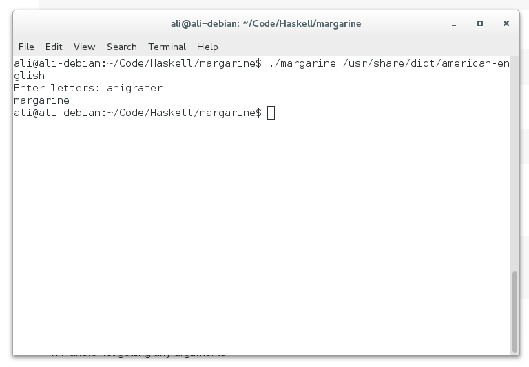

# margarine  v0.2.1

Simple anigram finder in Haskell. Aiming to be functional equivalent to anigramer.
Broken lets you find the longest 5 words you can type with a partiuclar set of keys.

### Project Files

```
margarine/
├── broken.hs
├── margarine
├── margarine.hs
└── README.md

0 directories, 4 files
```

### Dependencies

Compiled with GHC not external modules.

### Building

By default ghc will build a statically linked binary which weighs in at about 2.2MB, this is how the pre-built binary is made.

```
$ ghc --make -O2 margarine.hs
```

To get a smaller dynamically linked one about 25KB use the -dynamic flag.

```
$ ghc --make -O2 -dynamic margarine.hs
```

### Running

```
./margarine word_list
```

Where word_list is the path to a newline seperated list of words.

### Sample output

```
./margarine /usr/share/dict/american-english
Enter letters: anigramer
margarine
```



### Todo

1. Handle not getting any arguments
2. Merge broken into margarine